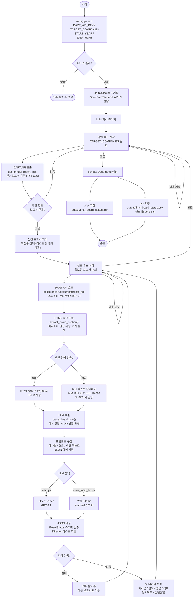
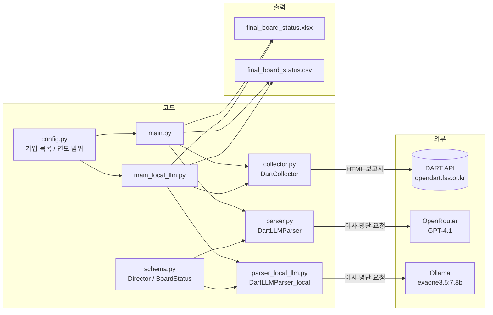
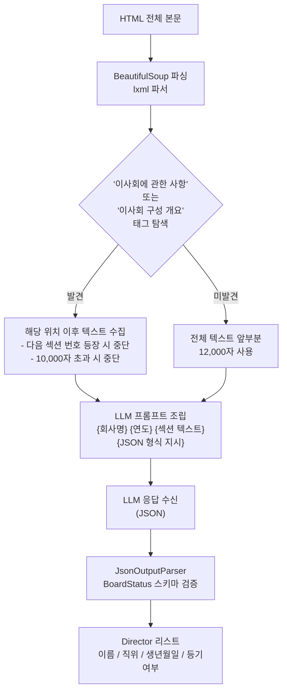

# 서비스 흐름도

## 전체 처리 흐름

```mermaid
flowchart TD
    A([시작]) --> B[config.py 로드\nDART_API_KEY / TARGET_COMPANIES\nSTART_YEAR / END_YEAR]
    B --> C{API 키 존재?}
    C -- 없음 --> Z1([오류 출력 후 종료])
    C -- 있음 --> D[DartCollector 초기화\nOpenDartReader에 API 키 전달]
    D --> E[LLM 파서 초기화]

    E --> F[기업 루프 시작\nTARGET_COMPANIES 순회]

    F --> G["DART API 호출\nget_annual_report_list()\n반기보고서 검색 (YYYY.06)"]
    G --> H{해당 연도\n보고서 존재?}
    H -- 없음 --> F
    H -- 있음 --> I["정정 보고서 처리\n최신본 선택 (리스트 첫 번째 항목)"]

    I --> J[연도 루프 시작\n확보된 보고서 순회]
    J --> K["DART API 호출\ncollector.dart.document(rcept_no)\n보고서 HTML 전체 내려받기"]

    K --> L["HTML 섹션 추출\nextract_board_section()\n'이사회에 관한 사항' 위치 탐색"]
    L --> M{섹션 탐색 성공?}
    M -- 실패 --> N[HTML 앞부분 12,000자\n그대로 사용]
    M -- 성공 --> O["섹션 텍스트 잘라내기\n다음 섹션 번호 또는 10,000자 초과 시 중단"]
    N --> P
    O --> P["LLM 호출\nparse_board_info()\n이사 명단 JSON 반환 요청"]

    P --> Q["프롬프트 구성\n회사명 / 연도 / 섹션 텍스트\nJSON 형식 지정"]
    Q --> R{LLM 선택}
    R -- main.py --> R1["OpenRouter\nGPT-4.1"]
    R -- main_local_llm.py --> R2["로컬 Ollama\nexaone3.5:7.8b"]
    R1 --> S
    R2 --> S["JSON 파싱\nBoardStatus 스키마 검증\nDirector 리스트 추출"]

    S --> T{파싱 성공?}
    T -- 실패 --> U[오류 출력 후\n다음 보고서로 이동]
    T -- 성공 --> V["행 데이터 누적\n회사명 / 연도 / 성명 / 직위\n등기여부 / 생년월일"]

    U --> J
    V --> J
    J -- 다음 연도 --> J
    J -- 완료 --> F
    F -- 다음 기업 --> F
    F -- 완료 --> W["pandas DataFrame 생성"]

    W --> X["xlsx 저장\noutput/final_board_status.xlsx"]
    W --> Y["csv 저장\noutput/final_board_status.csv\n인코딩: utf-8-sig"]
    X --> Z([종료])
    Y --> Z
```

---

## 주요 컴포넌트 관계

```mermaid
flowchart LR
    subgraph 외부
        DART[(DART API\nopendart.fss.or.kr)]
        LLM_cloud[OpenRouter\nGPT-4.1]
        LLM_local[Ollama\nexaone3.5:7.8b]
    end

    subgraph 코드
        config[config.py\n기업 목록 / 연도 범위]
        collector[collector.py\nDartCollector]
        parser_cloud[parser.py\nDartLLMParser]
        parser_local[parser_local_llm.py\nDartLLMParser_local]
        schema[schema.py\nDirector / BoardStatus]
        main_cloud[main.py]
        main_local[main_local_llm.py]
    end

    subgraph 출력
        xlsx[final_board_status.xlsx]
        csv[final_board_status.csv]
    end

    config --> main_cloud
    config --> main_local
    main_cloud --> collector
    main_local --> collector
    main_cloud --> parser_cloud
    main_local --> parser_local
    collector -- "HTML 보고서" --> DART
    parser_cloud -- "이사 명단 요청" --> LLM_cloud
    parser_local -- "이사 명단 요청" --> LLM_local
    schema --> parser_cloud
    schema --> parser_local
    main_cloud --> xlsx
    main_cloud --> csv
    main_local --> xlsx
    main_local --> csv
```

---

## LLM 파싱 상세 흐름

```mermaid
flowchart TD
    IN["HTML 전체 본문"] --> A["BeautifulSoup 파싱\nlxml 파서"]
    A --> B{"'이사회에 관한 사항'\n또는\n'이사회 구성 개요'\n태그 탐색"}
    B -- 발견 --> C["해당 위치 이후 텍스트 수집\n- 다음 섹션 번호 등장 시 중단\n- 10,000자 초과 시 중단"]
    B -- 미발견 --> D["전체 텍스트 앞부분\n12,000자 사용"]
    C --> E["LLM 프롬프트 조립\n{회사명} {연도} {섹션 텍스트}\n{JSON 형식 지시}"]
    D --> E
    E --> F["LLM 응답 수신\n(JSON)"]
    F --> G["JsonOutputParser\nBoardStatus 스키마 검증"]
    G --> H["Director 리스트\n이름 / 직위 / 생년월일 / 등기여부"]
```
